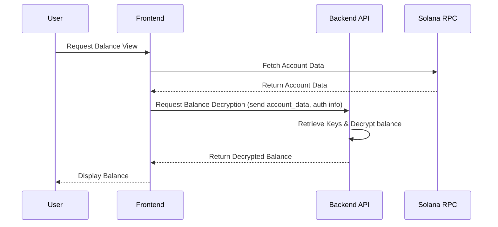

# TeeGee Pay

### Transact confidentially in Telegram, on Solana


## What is it?

A Telegram mini app enabling confidential transfers over Telegram, built on SPL Token‑2022's confidential transfers extension. The goal is to demonstrate the power of confidential transfers at the speed of Solana through every crypto user's favorite chat app: Telegram.

This project started during the [2026 Solana Privacy Hackathon](https://solana.com/privacyhack).

## Features

> 💡 The confidential mint/burn extension is not currently supported in the solana explorer. I opened a PR to update as part of the 2026 privacy hackathon, but you might need to run locally until the extension is supported if you want to view tokens with this extension enabled.
> https://github.com/solana-foundation/explorer/pull/836/changes#r2757682446

-   No complex jargon, no infinite transaction signing experiences, zero friction to get started
-   Use the features of Token2022 confidential transfers: deposit, withdraw, transfer
-   Enable frictionless confidential transfers to a Solana address or other Telegram users
-   Quickly check public and private balances and compare against explorer data
-   Custodial user kyepairs stored in a database (most basic, insecure hackathon demo), extensible to other solutions — AWS KMS, MPC solutions, etc
    -   The [aws-kms](https://github.com/jshiohaha/teegeepay/tree/aws-kms) branch contains an example of how one might use KMS for keypair managemeent. It's not included in the main branch because the non-zero cost of working with KMS. For simplicity and hackathon purposes, we maintain the most simple implementation.
-   Perform mint, transfer, and check blalance on an SPL token the following extensions: confidential transfer, confidential mint burn, metadata pointer, and token metadata

## Future Development

-   Add (optional) memos to transfers, fun and social
-   Allow users to on-ramp fiat to tgUSD to use directly on-chain, subsidized SOL funding
-   Instead of push based transfers (users only send payments), allow users to initiate payment requests Solana Pay style (QR code, link, etc)
-   Add multi-token support so users can manage multiple confidential mints in the same interface.
-   Consider showing transaction history so that users can see their previous transfers
-   Explore other privacy requirements from the users, without compromising on UX
-   Add support for devnet/mainnet when confidential transfers are re-enabled
-   Add Jito bundle support for atomic operations with <=5 transactions
-   Create a way to convert in and out of the app's canonical mint: USDC <> tgUSD
-   Clean up code, implementation got a bit messy

## Vision

TeeGee Pay starts as a hackathon demo to add privacy-first financial tooling to Telegram, but the opportunity is to become a private-by-default crypto app that can scale to mainstream users without even realizing it runs on crypto rails.

Telegram is a natural starting point due to its high usage amongst crypto usage, distribution, and social graph. Confidential tokens solve the missing piece: letting communities transact without exposing amounts. The core pattern and product can be extended to any product where users spend time and have the desire to transact.

We’ve seen a change in online activity from big, public forums to small, private chats. This payment infrastructure goes hand-in-hand with that trend — simple, fast, easy-to-use, and confidential.

## Architecture

The Next.js UI serves as a Telegram mini app that communicates with the Rust API backend. The API is responsible for everything else: managing wallet keypairs, associating them with telegram accounts, building and executeing Solana transactions.

Interesting read on the development of the confidential transfer account evolution and resulting structure: https://www.solana-program.com/docs/confidential-balances/encryption

### Implementation Details

-   Telegram doesn't have an embedded wallet interface, so a completely non-custodial implementation is not possible from within Telegram. Each user has a single custodial keypair that is used to derive the AES and ElGamal Key derivation. This way, we do not need to separately manage new, separate keys for encryption. On the other hand, the complexity of interfacing with wallets is abstracted since keypairs are completely custodial.
-   Confidential token actions require multiple signatures per instruction, so users would need to sign multiple messages without any abstraction when using the derived AES and ElGamal Key method.
-   This completely custodial solution kind of negates the strongest benefits of any confidential token operations. However, I believe there are still useful products that could be built with similar designs.
-   Ignores the complexity of dealing with non-atomic operations in a live cluster. For a real world application, we would need (1) more complex state management or (2) to use Jito bundles when possible. Working on a private Surfpool is convenient because transaction landing is a non-issue. More details [here](https://github.com/solana-developers/Confidential-Balances-Sample/blob/main/docs/wallet_guide_transfers.md#atomic).
-   Since keypairs are custodial, this application follows the trusted backend encryption/decryption model. The [confidential balances repository](https://github.com/solana-developers/Confidential-Balances-Sample/blob/main/docs/wallet_guide_balances.md#alternative-trusted-backend-decryption) has a nice diagram showing the decryption flow, so we include the same one here for convenience.



**Important Security Note**: This is **NOT** a secure production implementation and is intended for hackathon/demonstration purposes only.

## Tech Stack

### Backend

-   **Rust** with Axum web framework
-   **SQLx** for database operations
-   **Tokio** async runtime
-   **Solana 3.0** crates, **spl-token-client** for Token2022 operations
-   **PostgreSQL** for data persistence

### Frontend

-   Next.js
-   Telegram Mini App

### Solana

-   SPL Token-2022 with confidential transfer extensions
-   Surfpool for local testing
-   Helius RPC (surfpool syncing on localnet, main RPC on mainnet)
-   No custom smart contracts required

## Minimum Requirements

-   Node.js 20
-   Rust 1.92
-   Solana CLI 2.3
-   Docker and Docker Compose
-   pnpm
-   Solana cluster with confidential transfers enabled (right now, that is a local surfpool instance)

## Project Structure

```
.
├── crates
│   └── api              # Rust API backend
│       ├── src          # API source code
│       ├── migrations   # Database migrations
├── ui                   # Next.js frontend
└── scripts              # Utility scripts
```

## Setup

### 1. Environment Variables

Copy the example environment file and configure the variables in `.env` as needed:

```bash
cp .env.example .env
```

**Required Environment Variables:**

-   `TELEGRAM_BOT_TOKEN`: Your Telegram bot API token
-   `JWT_SECRET`: Secret key for JWT authentication
-   `AUTHORITY_KP`: Base58-encoded authority keypair for mint operations
-   `AUDITOR_KP`: Base58-encoded auditor keypair for confidential transfers
-   `RPC_URL`: Solana RPC endpoint with confidential transfer support

Set `DEV_MODE=true` when testing locally.

### 2. UI Environment Variables

Copy the example environment file and the variables in `.env` as needed:

```bash
cp ui/.env.example ui/.env
```

Set `NEXT_PUBLIC_DEV_MODE=true` when testing locally.

### 3. Solana Network

Ensure you have a Solana cluster running with confidential transfer support. For local development, use Surfpool. For the hackathon development, I built surfpool from source on [this](https://github.com/txtx/surfpool/tree/zk-edge) branch.

```bash
./target/release/surfpool start
```

Once re-deployed to devnet/mainnet, you can use those clustes.

## Development

### Start the Backend API

The API runs in Docker with PostgreSQL:

```bash
docker compose up --build
```

This will:

-   Start PostgreSQL database
-   Run database migrations
-   Start the Rust API on port 6767

### Start the Frontend

In a separate terminal:

```bash
cd ui
pnpm install
pnpm run dev
```

The UI will be available at `http://localhost:3000`.

## Utility Scripts

The `scripts/` directory contains helpful utilities mostly for local setup/testing.

-   `api-local.sh` - Run the API outside of Docker for development. You will need to specify a running PostgreSQL instance and Solana cluster.
-   `create-mint.sh` - Create a new token mint with confidential transfers
-   `reset-network.sh` - Reset the Surfpool network state
-   `run-migrations.sh` - Manually run database migrations
-   `db-up.sh` - Start only the database container
-   `container-down.sh` - Stop all containers

## Important Notes

-   This implementation is for **hackathon/demonstration purposes only**
-   Wallets are stored on the backend, which is **not secure** for production
-   Requires a Solana cluster with SPL Token-2022 and confidential transfer support
-   For production use, implement proper key management and custody solutions

## Acknowledgements

-   The [Confidential-Balances-Sample](https://github.com/solana-developers/Confidential-Balances-Sample) cookbook is extremely helpful for understanding how to work with the confidential transfer extension.
-   The [token-2022](https://github.com/solana-program/token-2022/tree/main) repository is a great source-of-truth for reading through state and instructions.
-   Breakdown of what [confidential transfers](https://solana.com/docs/tokens/extensions/confidential-transfer) are and how they work
-   Confidential balances [overview](https://www.solana-program.com/docs/confidential-balances), including protocol overview, encryption, and zero-knowledge proofs.
-   🌊 [Surfpool](https://www.surfpool.run) being the best way to test locally, no questions asked
-   Helius overview of [confidential-balances](https://www.helius.dev/blog/confidential-balances)

## License

MIT License. See `LICENSE`.
